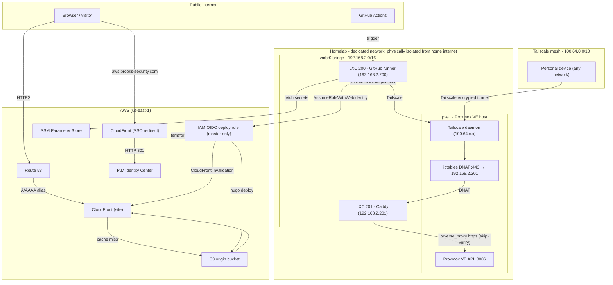
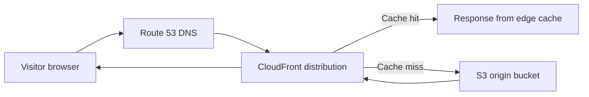
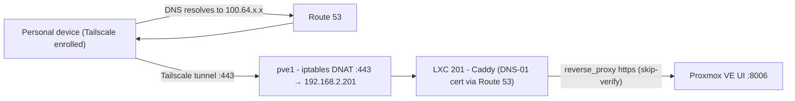
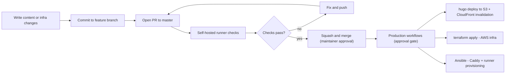

# GitOps
## Brooks-Security.com

This portfolio is managed with GitOps: content in Hugo, infrastructure in Terraform, and deployments automated through GitHub Actions running on a self-hosted runner inside a Proxmox homelab. The same repository that publishes this site also provisions the homelab containers that run its own CI/CD pipeline.

**Everything runs for about $0.50 per month in AWS.**

## Network overview

The infrastructure spans two planes: a **public AWS plane** for the website and SSO portal, and a **private homelab plane** behind Tailscale.

The homelab sits on a **dedicated network that is physically isolated from the household internet connection** - separate upstream, separate switch. Personal devices (laptops, phones) live on an entirely different network. The two never share a path. The only ingress to the homelab from anywhere outside it is through [Tailscale](https://tailscale.com), which creates an encrypted peer-to-peer mesh without requiring any open ports on the homelab's upstream router.

## Public website traffic

A CloudFront viewer-request function rewrites pretty URLs (`/posts/foo/`) to the underlying S3 key (`/posts/foo/index.html`). A separate CloudFront distribution at `aws.brooks-security.com` issues an HTTP 301 to the IAM Identity Center portal - no compute involved, just a CloudFront Function at the edge.

## Proxmox UI - `pve.brooks-security.com`

Route 53 resolves `pve.brooks-security.com` to pve1's Tailscale IP (`100.64.x.x`). Because Tailscale IPs are only routable within the mesh, this address is invisible to the public internet.

Caddy holds a browser-trusted certificate obtained via DNS-01 ACME challenge against Route 53 - no HTTP-01 challenge needed, which means the cert works even though the container has no public IP. From any enrolled device, `https://pve.brooks-security.com` opens the Proxmox UI with no port number and no certificate warning.

## CI/CD pipeline

All jobs run on the self-hosted runner inside LXC 200. Because that container is on the homelab network and enrolled in Tailscale, the runner can reach the Proxmox API and SSH into other containers - all without any public ingress.

## Security model

This is a **public repository** with a self-hosted runner. A malicious pull request could, without controls, execute arbitrary code on the runner. Several layers of defence address this:

| Control | Mechanism |
|---|---|
| **First-time contributor approval** | GitHub requires a maintainer to approve Actions runs on any PR from a contributor who has not previously had a PR merged |
| **OIDC role scoped to `master`** | The AWS deploy role trust policy uses `StringEquals` on `ref:refs/heads/master` - fork PRs cannot assume it |
| **Plan on PR, apply on merge** | `terraform plan` runs on PRs (read-only); `terraform apply` only runs after merge to `master` |
| **Production environment gate** | Apply and deploy jobs target the `production` GitHub environment, requiring an explicit approval before execution |
| **Secrets in SSM, not GitHub** | No long-lived credentials are stored in GitHub secrets; SSM Parameter Store is the source of truth |
| **Least-privilege IAM** | Caddy DNS-01 user, OIDC deploy role, and Proxmox API token are each scoped to the minimum permissions needed |
| **Physical network isolation** | The runner is on a network with no public ingress; the only entry point is Tailscale |

## What this costs

| Service | Monthly cost |
|---|---|
| Route 53 hosted zones (×2) | ~$1.00 |
| S3 storage + requests | ~$0.01 |
| CloudFront (low traffic) | ~$0.01 |
| ACM, SSM, IAM | $0.00 |
| **Total** | **~$0.50–1.00** |

The homelab hardware is sunk cost - Tailscale is free for personal use, and Proxmox is free (community edition).
