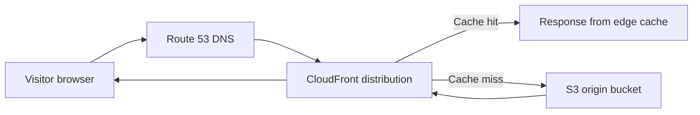
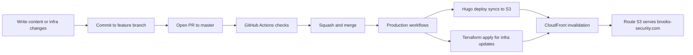

# GitOps
## Brooks-Security.com

This portfolio is managed with GitOps: content in Hugo, infrastructure in Terraform, and deployments automated through GitHub Actions. The repository `readme.md` describes the stack as Hugo + AWS (S3, CloudFront, Route 53) with Terraform managing infrastructure changes.

The key point: **everything runs for about $0.50 per month in AWS**.

## What the repo actually does

- Builds static content from `hugo/`
- Provisions and manages AWS resources from `terraform/`
- Runs checks on pull requests (Hugo build + Terraform validation/plan)
- Deploys on merge to `master` (`hugo deploy`, Terraform apply when infra changes, CloudFront invalidation)

## Traffic graph

## CI/CD graph (chain of custody)

