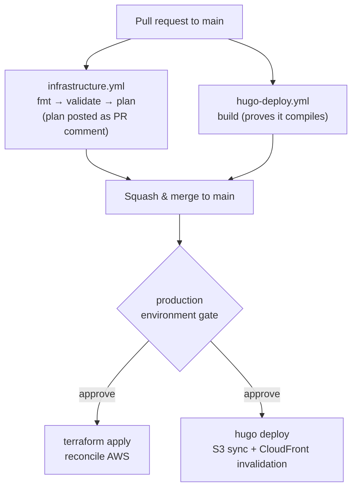
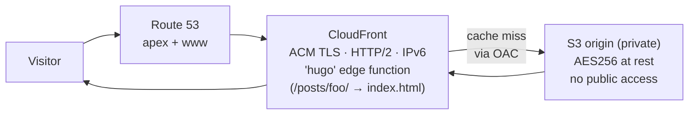
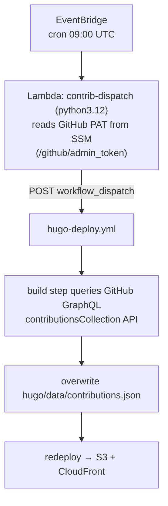
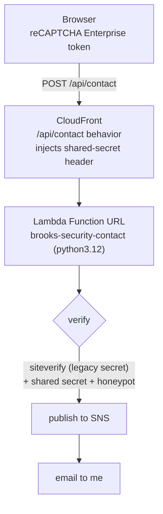

# GitOps
## Brooks-Security.com

[](https://github.com/LittleSeneca/brooks-security.com)

This site is the artifact of its own pipeline. A single public repository holds the Hugo content you are reading *and* the Terraform that provisions the AWS infrastructure serving it. Push to `main`, and GitHub Actions builds the site, syncs it to S3, invalidates CloudFront, and reconciles the cloud infrastructure with `terraform apply`. No servers to babysit, no deploy button to press.

**The whole thing runs for roughly $1 a month in AWS.**

## What runs where

| Layer | Technology |
|---|---|
| Content | Hugo with the `hugo-book` theme (git submodule) |
| Infrastructure as code | Terraform (`terraform/`) |
| Hosting | Private S3 origin bucket behind CloudFront |
| DNS / TLS | Route 53 + ACM (DNS-validated) |
| AWS access portal | IAM Identity Center, fronted by a CloudFront 301 redirect |
| Scheduled jobs | EventBridge → Lambda (nightly heatmap refresh) |
| Contact form | Lambda Function URL behind CloudFront, with reCAPTCHA Enterprise + SNS email |
| Secrets | AWS SSM Parameter Store |
| CI/CD | GitHub Actions on **GitHub-hosted runners** |

A note on what this is **not**: there is no self-hosted runner, no Ansible, and nothing in the deployment path touching a homelab. Everything here runs on ephemeral GitHub-hosted runners against AWS. A separate Proxmox and Tailscale homelab does exist for private experiments, but it sits deliberately outside this repo's deploy path. More on that at the end.

## Repository layout

```text
.
├── .github/workflows/
│   ├── infrastructure.yml      # terraform fmt → validate → plan/apply
│   └── hugo-deploy.yml         # hugo build → deploy → CloudFront invalidation
├── hugo/                       # site content, config, theme submodule, data/
├── terraform/
│   ├── *.tf                    # s3, cloudfront, route53, acm, iam, sso, lambda, contact
│   ├── imports.tf              # import blocks adopting pre-existing resources
│   ├── bootstrap/              # one-time: tfstate bucket + lock table
│   └── files/                  # CloudFront function + Lambda source
├── specs/                      # design docs for in-flight work
└── readme.md
```

## How a change ships

Two workflows, both triggered on every push and pull request to `main`. Each uses a `paths-filter` so it only does real work when its own files changed. The checks still *report* either way, so branch protection's required status checks are satisfied on every PR.



- **On a PR:** `infrastructure.yml` runs `terraform fmt -check`, `validate`, and `plan`, then posts the plan as a sticky PR comment so the diff is reviewable inline. `hugo-deploy.yml` builds the site to prove it compiles.
- **On merge to `main`:** the `apply` and `deploy` jobs run. Both target the `production` GitHub Environment, so they pause for an explicit approval before touching anything. `terraform apply` reconciles AWS; `hugo deploy` syncs the rendered site to S3 and invalidates the CloudFront cache.

## Public site architecture

The site is a pile of static files in a **private** S3 bucket. The bucket blocks all public access; CloudFront is the only thing allowed to read it, via an Origin Access Control and a bucket policy scoped to the distribution's ARN.



`hugo deploy` reads the `[deployment]` block in `hugo.toml`: it pushes `hugo/public/` to `s3://brooks-security.com`, sets long-lived `Cache-Control` headers on hashed assets, and invalidates the distribution. A small CloudFront Function (`terraform/files/hugo-cf-function.js`) runs at the edge on every viewer request and turns Hugo's pretty URLs into the underlying `index.html` keys, so directory-style links resolve at the edge without an origin round trip.

## AWS access portal: `aws.brooks-security.com`

A second, tiny CloudFront distribution exists purely to give the IAM Identity Center login page a memorable address. Its only origin is a dummy; a CloudFront Function intercepts every request and returns a `301` to the real IAM Identity Center portal URL. No compute, no S3, just a redirect at the edge.

Terraform also manages the identity side of this: the Identity Center user, an `AdministratorAccess` permission set, and the account assignment that binds them. (IAM Identity Center itself must be enabled once by hand in the console before Terraform can manage these resources.)

## Nightly contribution-heatmap refresh

The homepage shows a GitHub-style contribution heatmap, rendered as static inline SVG from `hugo/data/contributions.json`. That file is re-baked once a day so the calendar stays current without a human in the loop:



Kicking the workflow from EventBridge, rather than a GitHub Actions `schedule:` cron, is deliberate: GitHub auto-disables scheduled workflows after 60 days of repository inactivity, which a personal site can easily hit. EventBridge never sleeps. The whole job is one Lambda invocation per day, which is effectively free, and the heatmap fetch is fully fail-soft: any error leaves the last-known-good JSON in place so the build still succeeds.

## Contact form: serverless, same-origin, and basically free

The Services section has a working contact form, and adding it didn't change the cost story or the shape of the architecture. There is no API Gateway and no always-on backend. A single new CloudFront behavior routes `/api/contact` to a Lambda Function URL, so the browser posts to the same origin it loaded from, with no CORS to wrangle.



The Lambda does three things: confirm the request actually came through CloudFront (via a secret header CloudFront injects, so the public Function URL can't be hit directly), verify the token via the legacy `siteverify` endpoint and reject invalid tokens or low scores, then publish the message to an SNS topic that emails me. The key is a reCAPTCHA Enterprise score key, but it carries a legacy secret for exactly this classic-endpoint path, so no Google Cloud API key or service account is needed. The legacy secret and public site key live in SSM; the site key is baked into the Hugo build at build time, and the Lambda reads the secret at runtime, neither entering Terraform state.

This is the whole point of well-tailored tooling. A dynamic feature, with bot protection and email delivery, bolted onto a static site for a rounding error. Reaching for API Gateway or a managed form service would have added monthly cost and moving parts; a Function URL behind the CloudFront distribution I already run adds neither.

## Terraform state & bootstrap

State lives in an S3 backend (`brooks-security-tfstate`) with a DynamoDB lock table. Both are created once by the small `terraform/bootstrap/` module, whose own state is local and committed to the repo, which is the usual chicken-and-egg escape hatch. The main configuration adopts the already-existing AWS resources through `terraform/imports.tf`: a set of `import` blocks that pull live Route 53, ACM, S3, and CloudFront resources under management, so the steady-state plan is a clean no-op.

## Security model

| Control | What it does |
|---|---|
| **Ephemeral GitHub-hosted runners** | CI runs on disposable runners with no path into any private network; there is no long-lived self-hosted runner to compromise |
| **Plan on PR, apply on merge** | `terraform plan` runs read-only on PRs; `apply` only runs after merge to `main` |
| **Production environment gate** | `apply` and `deploy` jobs target the `production` GitHub Environment, requiring explicit approval before they execute |
| **First-time contributor approval** | GitHub requires a maintainer to approve workflow runs on PRs from contributors with no prior merged PR |
| **Private origin** | The S3 bucket blocks all public access; only CloudFront can read it, via Origin Access Control |
| **Secrets in SSM** | The GitHub PAT (heatmap job) and the reCAPTCHA legacy secret + site key (contact form) live in SSM Parameter Store and are referenced by ARN, never pulled into Terraform state |
| **Least-privilege IAM** | The deploy credentials and both Lambda roles are each scoped to the minimum actions they need (S3 + CloudFront for deploys; SSM read + scoped KMS decrypt for the heatmap Lambda; SSM read + scoped KMS decrypt + single-topic SNS publish for the contact Lambda) |
| **Bot protection** | The contact form gates submissions with reCAPTCHA v3 scoring and a honeypot field, dropping bots before they reach the inbox |
| **CloudFront-only Lambda** | The contact Lambda's Function URL is unauthenticated but rejects any request missing a secret header that only CloudFront injects, so it cannot be invoked directly |

**On deploy credentials:** today the workflows authenticate to AWS with a scoped IAM user's access keys, stored as GitHub Actions secrets and passed through the standard credential chain (no profile in CI). A GitHub OIDC provider and a dedicated deploy role are already defined in `terraform/iam.tf`, staged for a planned cutover to short-lived, keyless credentials. When that lands, the static keys go away.

## What it costs

| Service | Monthly cost |
|---|---|
| Route 53 hosted zone | ~$0.50 |
| S3 storage + requests | ~$0.01 |
| CloudFront (low traffic, two distributions) | ~$0.01 |
| Lambda + EventBridge (heatmap + contact form) | ~$0.00 |
| SNS (contact-form emails) | ~$0.00 |
| ACM, SSM, IAM, Identity Center | $0.00 |
| **Total** | **~$1/month** |

Adding the contact form didn't move this total. That's the dividend of choosing serverless, pay-per-use building blocks and reusing the infrastructure already in place instead of bolting on a managed service for every new feature.

## The homelab (out of band)

For full transparency: a separate Proxmox and Tailscale homelab exists and is reachable privately at `pve.brooks-security.com` over the Tailscale mesh. It is **not** part of this repository's deployment path and not managed by the Terraform here. The site ships entirely through GitHub-hosted runners and AWS. Homelab work that *is* tracked in this repo lives under `specs/` as design docs, for example an in-design `code-server` LXC, kept separate from the production site pipeline on purpose.
