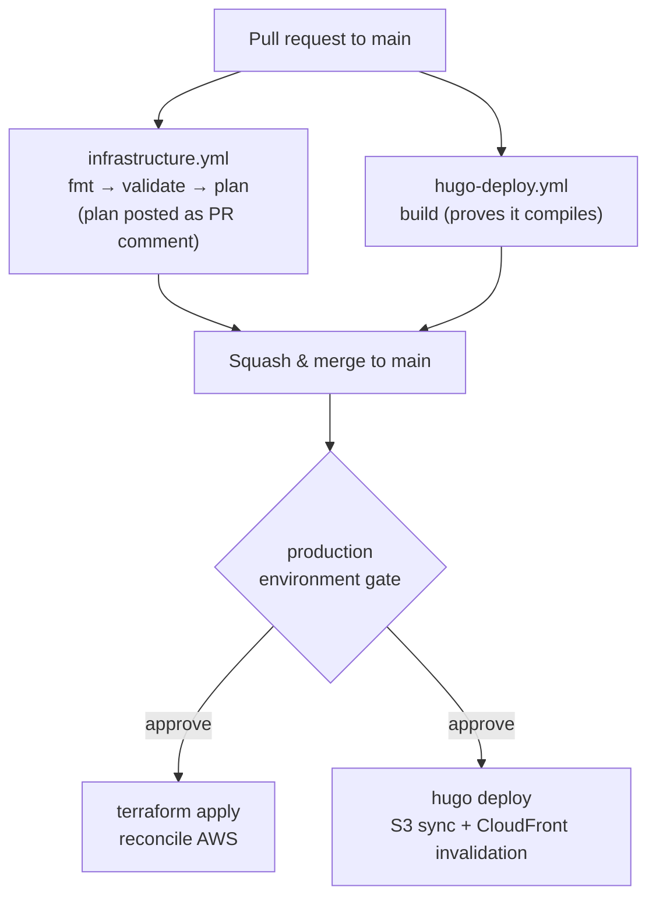
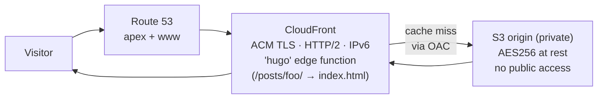
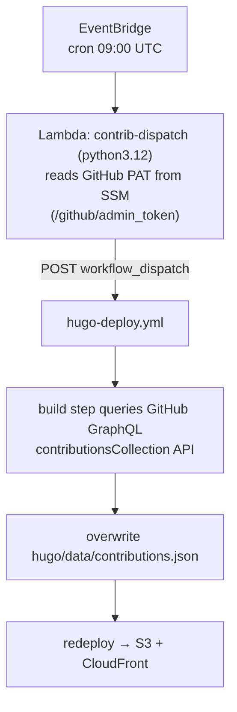
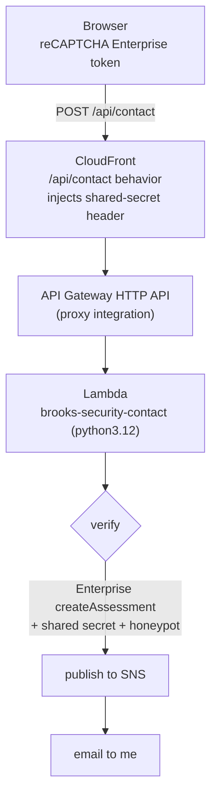
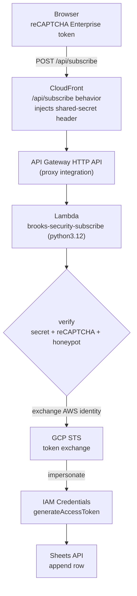

# GitOps
## Brooks-Security.com

[](https://github.com/LittleSeneca/brooks-security.com)

This site builds and ships itself. One public repository holds both the Hugo content you're reading and the Terraform that runs the AWS infrastructure serving it. I push to `main`, and GitHub Actions takes it from there: build the site, sync it to S3, invalidate CloudFront, and reconcile the cloud with `terraform apply`. No servers to babysit, no deploy button to press.

**I build in the open on purpose.** Most security advice tells you to hide how things work. I do the opposite.

That is [Kerckhoffs's Principle](https://en.wikipedia.org/wiki/Kerckhoffs%27s_principle): a system should stay secure even when everyone can see exactly how it works. The secrecy lives in the keys, not in the design. So I don't hide the design. Read every line of Terraform, trace how the site is built, served, and locked down, and stand up your own copy if you want one. You still can't break mine, because you don't hold my keys. I won't call it unbreakable, because nothing is, but there's no hidden trick to find. The whole attack surface is a short list of secrets in SSM and a few tightly scoped IAM roles.

Jeff Moser makes the point better than I can, in [*A Stick Figure Guide to the Advanced Encryption Standard (AES)*](https://www.moserware.com/2009/09/stick-figure-guide-to-advanced.html):

[](https://www.moserware.com/2009/09/stick-figure-guide-to-advanced.html)

*Image: “Big Idea #3: Secrecy Only in the Key,” by Jeff Moser, from [A Stick Figure Guide to the Advanced Encryption Standard (AES)](https://www.moserware.com/2009/09/stick-figure-guide-to-advanced.html) (Moserware). Used with permission; all rights remain with the author.*

**The whole thing runs for roughly $1 a month in AWS.**

## What runs where

| Layer | Technology |
|---|---|
| Content | Hugo with the `hugo-book` theme (git submodule) |
| Infrastructure as code | Terraform (`terraform/`) |
| Hosting | Private S3 origin bucket behind CloudFront |
| DNS / TLS | Route 53 + ACM (DNS-validated) |
| AWS access portal | IAM Identity Center, fronted by a CloudFront 301 redirect |
| Scheduled jobs | EventBridge → Lambda (nightly heatmap refresh) |
| Contact form | API Gateway HTTP API behind CloudFront, with reCAPTCHA Enterprise + SNS email |
| Lead capture | Same API Gateway HTTP API (`/api/subscribe`) → Lambda that appends to a Google Sheet, authenticated keyless via Workload Identity Federation |
| Secrets | AWS SSM Parameter Store |
| CI/CD | GitHub Actions on **GitHub-hosted runners** |

What this isn't: no self-hosted runner, no Ansible, no servers to patch, and no static Google service-account key anywhere. It all runs on throwaway GitHub-hosted runners against AWS.

## Repository layout

```text
.
├── .github/workflows/
│   ├── infrastructure.yml      # terraform fmt → validate → plan/apply
│   └── hugo-deploy.yml         # hugo build → deploy → CloudFront invalidation
├── hugo/                       # site content, config, theme submodule, data/
├── terraform/
│   ├── *.tf                    # s3, cloudfront, route53, acm, iam, sso, lambda, contact, subscribe
│   ├── imports.tf              # import blocks adopting pre-existing resources
│   ├── bootstrap/              # one-time: tfstate bucket + lock table
│   └── files/                  # CloudFront function, Lambda source, google-auth layer (committed)
├── specs/                      # design docs for in-flight work
└── readme.md
```

## How a change ships

Two workflows run on every push and pull request to `main`. Each uses a `paths-filter`, so it only does real work when its own files changed. The checks still report either way, so my required status checks pass on every PR.



- **On a PR:** `infrastructure.yml` runs `terraform fmt -check`, `validate`, and `plan`, then posts the plan as a sticky PR comment so the diff is reviewable inline. `hugo-deploy.yml` builds the site to prove it compiles.
- **On merge to `main`:** the `apply` and `deploy` jobs run. Both target the `production` GitHub Environment, so they pause for an explicit approval before touching anything. `terraform apply` reconciles AWS; `hugo deploy` syncs the rendered site to S3 and invalidates the CloudFront cache.

## Public site architecture

The site is just static files in a **private** S3 bucket. The bucket blocks all public access. CloudFront is the only thing allowed to read it, through an Origin Access Control and a bucket policy scoped to the distribution's ARN.



`hugo deploy` reads the `[deployment]` block in `hugo.toml`: it pushes `hugo/public/` to `s3://brooks-security.com`, sets long-lived `Cache-Control` headers on hashed assets, and invalidates the distribution. A small CloudFront Function (`terraform/files/hugo-cf-function.js`) runs at the edge on every viewer request and turns Hugo's pretty URLs into the underlying `index.html` keys, so directory-style links resolve at the edge without an origin round trip.

## AWS access portal: `aws.brooks-security.com`

I run a second, tiny CloudFront distribution for one reason: to give the IAM Identity Center login page a memorable address. Its only origin is a dummy. A CloudFront Function intercepts every request and returns a `301` to the real Identity Center portal URL. No compute, no S3, just a redirect at the edge.

Terraform manages the identity side too: the Identity Center user, an `AdministratorAccess` permission set, and the account assignment that binds them. (I have to enable IAM Identity Center by hand in the console once before Terraform can manage these resources.)

## Nightly contribution-heatmap refresh

The homepage shows a GitHub-style contribution heatmap, rendered as static inline SVG from `hugo/data/contributions.json`. That file is re-baked once a day so the calendar stays current without a human in the loop:



I kick the workflow from EventBridge instead of a GitHub Actions `schedule:` cron on purpose. GitHub auto-disables scheduled workflows after 60 days of repo inactivity, which a personal site can easily hit. EventBridge never sleeps. The whole job is one Lambda invocation a day, basically free, and the fetch is fail-soft: any error leaves the last good JSON in place so the build still succeeds.

## Contact form

The Services section has a working contact form, and adding it didn't change the cost or the shape of the architecture. One CloudFront behavior routes `/api/contact` to an API Gateway HTTP API, so the browser posts to the same origin it loaded from, with no CORS to wrangle. Nothing is always-on; I pay per request for both API Gateway and Lambda.



The Lambda does three things: confirm the request actually came through CloudFront (via a secret header CloudFront injects, so the public API can't be hit directly), create a reCAPTCHA Enterprise assessment for the token and reject invalid tokens or low scores, then publish the message to an SNS topic that emails me. Verification uses a Google Cloud API key and the owning project rather than a classic secret key. The API key and public site key live in SSM; the site key is also baked into the Hugo build at build time, and the Lambda reads both at runtime, neither entering Terraform state.

This is the kind of result I want from picking the right building blocks: a dynamic feature, with bot protection and email delivery, bolted onto a static site for a rounding error. API Gateway's HTTP API is pay-per-request, about $1 per million calls, which for a contact form rounds to zero. A real backend that adds no always-on infrastructure and no meaningful cost.

## Lead-magnet capture, keyless into Google Sheets

The readiness-checklist landing page captures signups into a live Google Sheet. It reuses the contact form's whole anti-abuse posture, the CloudFront origin secret, reCAPTCHA Enterprise, and a honeypot, on a second route (`/api/subscribe`) on the same API Gateway HTTP API. The interesting part is how it writes to Google, because it does it without a key.

Google's organization policy here blocks service-account key creation outright, which is the right default. So instead of a static key sitting in SSM, the Lambda uses Workload Identity Federation: its AWS execution role federates into GCP and impersonates a keyless service account, and only that service account is shared on the Sheet.



The trust chain runs entirely on identity, no shared secret crosses the boundary. GCP's workload identity pool is pinned to the exact assumed-role ARN of the `brooks-security-subscribe` role, so only that Lambda can federate. It exchanges its AWS identity for a short-lived GCP token at Google's STS endpoint, then impersonates the service account to get an access token, then appends the row. The only out-of-band material is the federation config (identifiers, not a secret) and the spreadsheet id, both in SSM and read at runtime. There is no key to leak, rotate, or commit by accident.

The one dependency this adds is `google-auth`, for the token exchange, shipped as a Lambda layer whose build is committed to the repo so it stays visible and reproducible. The rest of the handler is standard library, including a small urllib transport so the federated refresh and the Sheets call never need a heavier HTTP dependency.

## Terraform state & bootstrap

State lives in an S3 backend (`brooks-security-tfstate`) with a DynamoDB lock table. A small `terraform/bootstrap/` module creates both once; its own state is local and committed to the repo, which is the usual chicken-and-egg escape hatch. The main config adopts the resources that already existed through `terraform/imports.tf`: `import` blocks that pull live Route 53, ACM, S3, and CloudFront under management, so the steady-state plan is a clean no-op.

## Security model

| Control | What it does |
|---|---|
| **Ephemeral GitHub-hosted runners** | CI runs on disposable runners with no path into any private network; there is no long-lived self-hosted runner to compromise |
| **Plan on PR, apply on merge** | `terraform plan` runs read-only on PRs; `apply` only runs after merge to `main` |
| **Production environment gate** | `apply` and `deploy` jobs target the `production` GitHub Environment, requiring explicit approval before they execute |
| **First-time contributor approval** | GitHub requires a maintainer to approve workflow runs on PRs from contributors with no prior merged PR |
| **Private origin** | The S3 bucket blocks all public access; only CloudFront can read it, via Origin Access Control |
| **Secrets in SSM** | The GitHub PAT (heatmap job), the reCAPTCHA Enterprise API key + site key (forms), and the subscribe path's federation config + spreadsheet id all live in SSM Parameter Store and are referenced by ARN, never pulled into Terraform state |
| **Keyless Google access** | The subscribe Lambda writes to Google with no service-account key. It federates into GCP via Workload Identity Federation and impersonates a keyless service account; the workload identity pool trusts only the `brooks-security-subscribe` role's assumed-role ARN |
| **Least-privilege IAM** | The deploy credentials and all three Lambda roles are each scoped to the minimum actions they need (S3 + CloudFront for deploys; SSM read + scoped KMS decrypt for the heatmap Lambda; the same plus single-topic SNS publish for the contact Lambda; SSM read + scoped KMS decrypt for the subscribe Lambda, which reaches Google purely through federated identity) |
| **Bot protection** | Both forms gate submissions with reCAPTCHA Enterprise scoring and a honeypot field, dropping bots before they reach the inbox or the Sheet |
| **CloudFront-only backend** | The contact and subscribe APIs are publicly reachable but each Lambda rejects any request missing a secret header that only CloudFront injects, so the APIs cannot be invoked directly |

**On deploy credentials:** right now the workflows authenticate to AWS with a scoped IAM user's access keys, stored as GitHub Actions secrets and passed through the standard credential chain (no profile in CI). I've already defined a GitHub OIDC provider and a dedicated deploy role in `terraform/iam.tf`, staged for a cutover to short-lived, keyless credentials. When that lands, the static keys go away.

## What it costs

| Service | Monthly cost |
|---|---|
| Route 53 hosted zone | ~$0.50 |
| S3 storage + requests | ~$0.01 |
| CloudFront (low traffic, two distributions) | ~$0.01 |
| Lambda + API Gateway + EventBridge (heatmap + contact + subscribe) | ~$0.00 |
| SNS (contact-form emails) | ~$0.00 |
| ACM, SSM, IAM, Identity Center | $0.00 |
| Google Sheets API (lead capture) | $0.00 |
| **Total** | **~$1/month** |

Neither the contact form nor the lead-capture path moved this total. That's what I get for sticking to serverless, pay-per-use pieces and reusing what I already run, instead of bolting on a managed service for every new feature. The subscribe path even reused the contact form's API Gateway and origin secret outright, so the second feature cost a route and a Lambda, nothing more.
